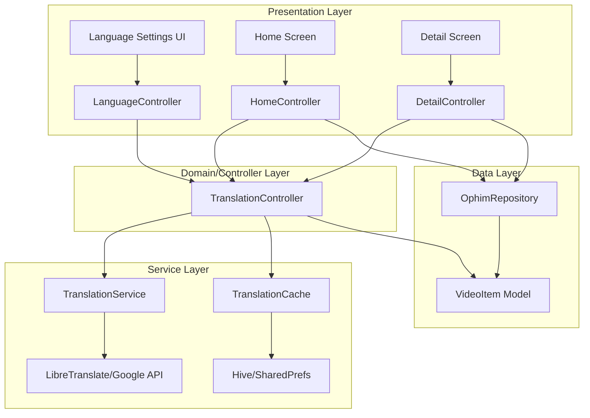
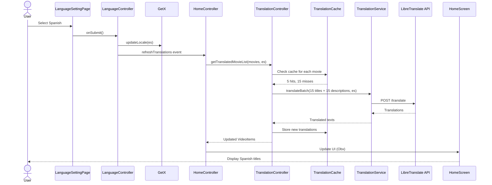
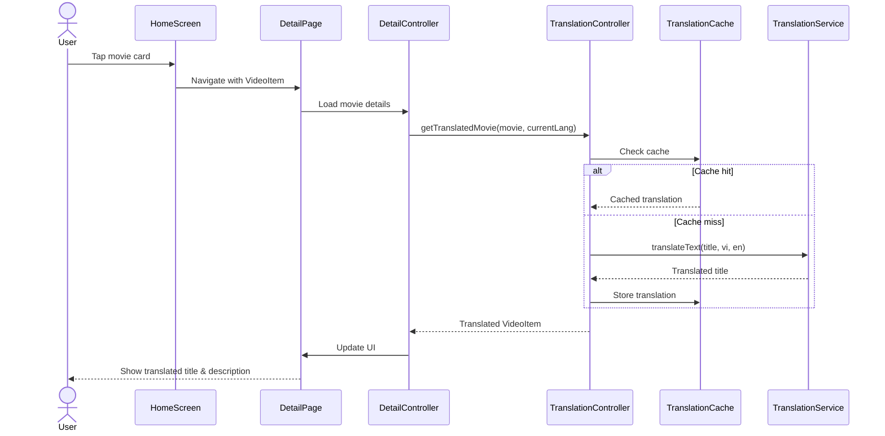

# Design - Movie Content Translation

## Architecture Overview
This feature integrates real-time translation of movie metadata (titles, descriptions) with the existing language selection system, using a layered architecture approach consistent with the project's Feature-First + Layered Architecture pattern.

---

## System Components



---

## Component Details

### 1. TranslationService (`lib/app/services/translation_service.dart`)
**Responsibility**: Interface with external translation API

**Key Methods**:
- `Future<String> translateText(String text, String sourceLang, String targetLang)`
- `Future<Map<String, String>> translateBatch(List<String> texts, String sourceLang, String targetLang)`
- `String _mapLanguageCode(LanguageCode code)` - Convert app lang codes to API format

**Design Decisions**:
- **Service Choice**: Wait for user decision (LibreTranslate vs Google Translate)
- **Batch Support**: Reduce API calls by batching multiple translations
- **Error Handling**: Return original text on failure, don't throw exceptions to UI
- **Retry Logic**: Exponential backoff (3 retries: 1s, 2s, 4s delays)

**Trade-offs**:
- ✅ **Pro**: Centralized translation logic, easy to swap APIs
- ❌ **Con**: External API dependency increases latency

---

### 2. TranslationCache (`lib/app/services/translation_cache.dart`)
**Responsibility**: Cache translated content to minimize API calls

**Cache Key Format**: `{movieSlug}:{field}:{langCode}` (e.g., `phim-abc-123:title:en`)

**Storage Options**:
| Option | Pros | Cons | Recommendation |
|--------|------|------|----------------|
| **SharedPreferences** | Simple, already in project | Limited storage (~10MB), slower for bulk ops | Use if translations < 500 |
| **Hive** | Fast, larger capacity, structured | Requires setup, small learning curve | **Recommended** for 1000+ translations |

**Cache Policies**:
- **TTL (Time-To-Live)**: 30 days (configurable)
- **Eviction**: LRU when exceeding 1000 entries
- **Invalidation**: On app version update or manual clear

**Design Decisions**:
- Store translations separately from movie data (avoid polluting `VideoItem`)
- Use composite key to support multiple languages per movie
- Implement async access to avoid blocking UI thread

---

### 3. TranslationController (`lib/features/translation/controller/translation_controller.dart`)
**Responsibility**: Orchestrate translation flow between UI and services

**Key Methods**:
- `Future<VideoItem> getTranslatedMovie(VideoItem movie, LanguageCode lang)`
- `Future<List<VideoItem>> getTranslatedMovieList(List<VideoItem> movies, LanguageCode lang, {int batchSize = 20})`
- `void clearCache()`

**Reactive State**:
```dart
final RxBool isTranslating = false.obs;
final RxString translationError = ''.obs;
final RxMap<String, VideoItem> translatedMovies = <String, VideoItem>{}.obs;
```

**Design Decisions**:
- Use GetX reactive programming for loading states
- Batch translation in chunks of 20 to balance speed vs API limits
- Return enriched `VideoItem` objects instead of creating new wrapper class (simpler)

---

### 4. Model Extension Strategy

**Option A: Extend VideoItem (Chosen)**
```dart
class VideoItem {
  final String title;
  final String? translatedTitle;  // NEW
  final String? description;
  final String? translatedDescription;  // NEW
  
  String getDisplayTitle(LanguageCode currentLang) {
    return currentLang == LanguageCode.vi ? title : (translatedTitle ?? title);
  }
}
```

**Option B: Wrapper Class (Rejected)**
```dart
class TranslatedMovie {
  final VideoItem original;
  final Map<LanguageCode, String> titles;
  final Map<LanguageCode, String> descriptions;
}
```

**Why Option A**:
- ✅ Simpler to integrate with existing code
- ✅ No need to refactor all usages of `VideoItem`
- ✅ Nullable fields maintain backward compatibility
- ❌ Less pure (mixes original + translated data)

---

## Data Flow Diagrams

### Flow 1: User Changes Language


### Flow 2: Open Movie Detail


---

## Performance Considerations

### Challenge: Translation Latency
**Problem**: Translating 20 movies × 2 fields = 40 API calls could take 5-10 seconds

**Solutions**:
1. **Batch API Requests**: Combine multiple texts into single API call
2. **Lazy Loading**: Translate only visible movies (viewport-based)
3. **Aggressive Caching**: 30-day TTL to minimize repeat calls
4. **Optimistic UI**: Show original text immediately, swap when translation ready

**Benchmarks** (estimated):
- Cache hit: < 50ms
- Single translation (no cache): 500-1000ms
- Batch 20 translations: 2-3 seconds

### Challenge: Scroll Performance
**Problem**: Translating every movie as user scrolls could cause jank

**Solution**: Debounce translation requests
```dart
Timer? _translationDebounce;
void onScroll() {
  _translationDebounce?.cancel();
  _translationDebounce = Timer(Duration(milliseconds: 300), () {
    _translateVisibleMovies();
  });
}
```

---

## Error Handling

### Error Scenarios & Responses

| Scenario | Response | User Feedback |
|----------|----------|---------------|
| Translation API down | Show original Vietnamese text | Silent (log error) |
| Network timeout | Return cached translation if exists, else original | Toast: "Using cached translations" |
| Invalid API key | Disable translation feature, show original | Snackbar: "Translation unavailable" |
| Rate limit exceeded | Retry with exponential backoff | Loading indicator |

### Graceful Degradation
- Translation is **enhancement, not blocker**: App must work without it
- Always fallback to original text if translation unavailable
- Cache previous translations to survive temporary API outages

---

## Security & Privacy

### API Key Management
- **Google Translate**: Store API key in environment variables, **never commit to Git**
- **LibreTranslate**: If self-hosted, URL in config; if public instance, no key needed

### Data Privacy
- Translation API receives: Movie titles and descriptions (public data)
- **No user data** sent to translation service
- Consider: Self-hosted LibreTranslate for full data control

---

## Future Enhancements (Out of Scope)

1. **Offline Translation**: Integrate `ml_kit` for on-device translation (limited languages)
2. **User Edits**: Allow users to suggest better translations (crowdsourcing)
3. **Translation Quality**: Add confidence scores, highlight low-confidence translations
4. **Actor/Director Names**: Translate proper nouns using specialized service

---

## Open Technical Decisions

> [!WARNING]
> **Requires User Input Before Implementation**

1. **Translation API Selection**:
   - **LibreTranslate** (open-source): Need server URL (self-hosted or public instance)
   - **Google Translate**: Need API key and billing account

2. **Cache Storage**:
   - **SharedPreferences**: Simpler, but limited to ~10MB
   - **Hive**: More robust, but requires setup
   - **Decision depends on**: Expected number of movies × languages (e.g., 1000 movies × 7 langs = 7000 cache entries)

3. **Translation Scope**:
   - Translate **titles + descriptions** (2 fields) 
   - Or also translate **actor names, director names**? (Proper nouns may translate poorly)

4. **Cache Expiration**:
   - **30 days**: Balance between freshness and API costs
   - **Permanent**: Never expire (unless manually cleared)
   - **User preference**: Let user choose in advanced settings?

---

## Verification Plan

### Automated Tests
1. **Unit Tests** (`test/app/services/translation_service_test.dart`)
   - Mock translation API responses
   - Test error handling and retries
   - Verify language code mapping

2. **Widget Tests** (`test/features/home/pages/home_page_test.dart`)
   - Test translated title display
   - Test loading states during translation

### Manual Testing Checklist
1. **Happy Path**:
   - [ ] Select language in settings → Home screen movies translate
   - [ ] Open movie detail → Title and description translate
   - [ ] Scroll home screen → Lazy-loaded movies translate

2. **Edge Cases**:
   - [ ] Switch language rapidly → No crashes, last selection wins
   - [ ] Airplane mode → Fallback to original text
   - [ ] Very long movie titles (100+ chars) → UI handles gracefully

3. **Performance**:
   - [ ] Home screen loads in < 3 seconds with translation
   - [ ] Scroll remains smooth (60 FPS) during lazy translation
   - [ ] App cold start with cached translations < 2 seconds

### Success Criteria
- ✅ All 7 languages translate correctly
- ✅ Cache hit rate > 80% after first use
- ✅ No crashes on translation API failure
- ✅ Scroll performance (jank) < 5% compared to no translation
